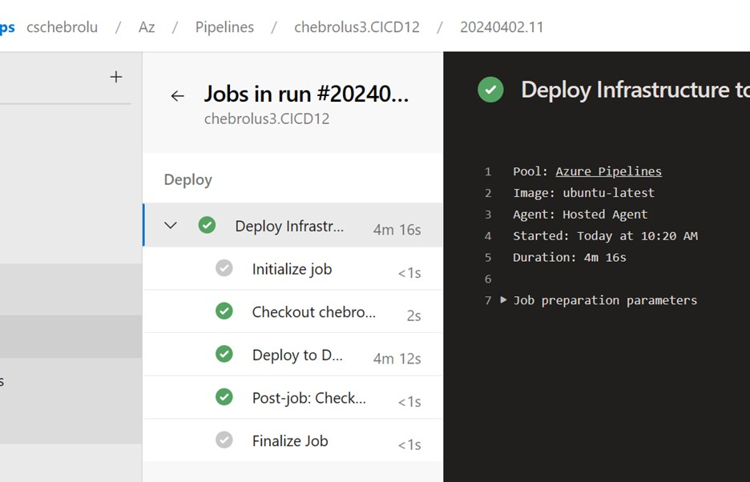
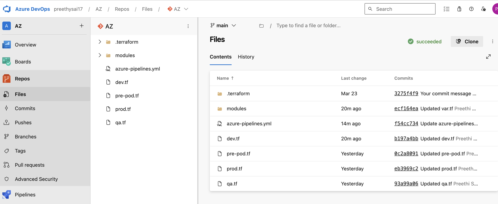
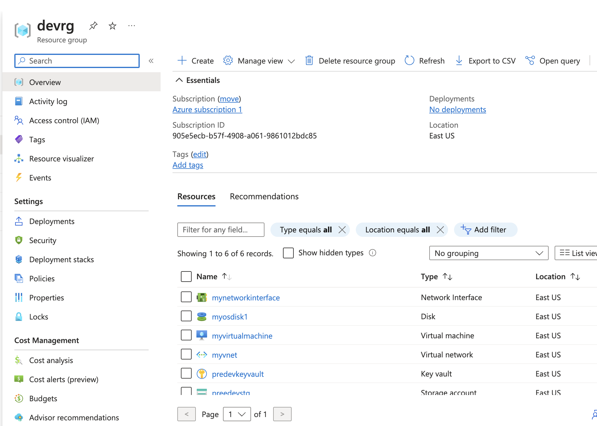
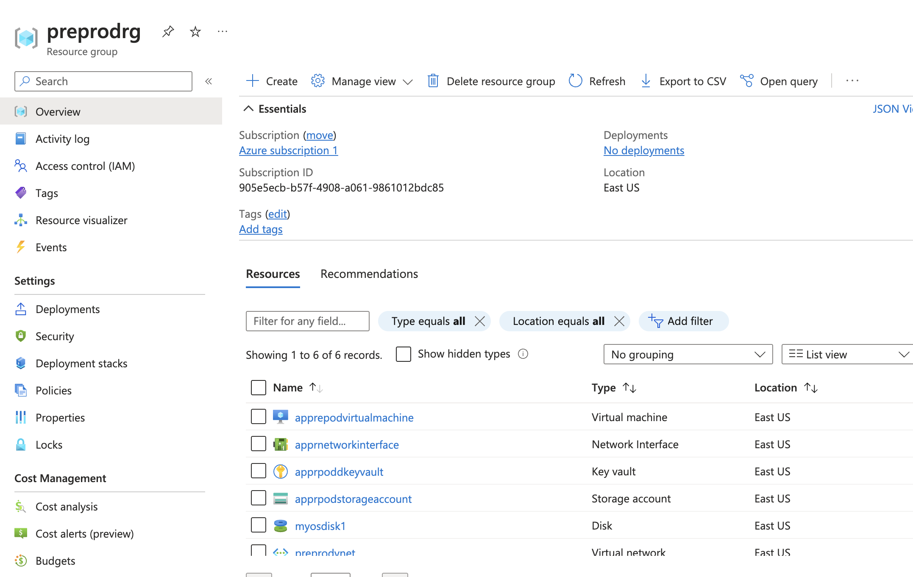
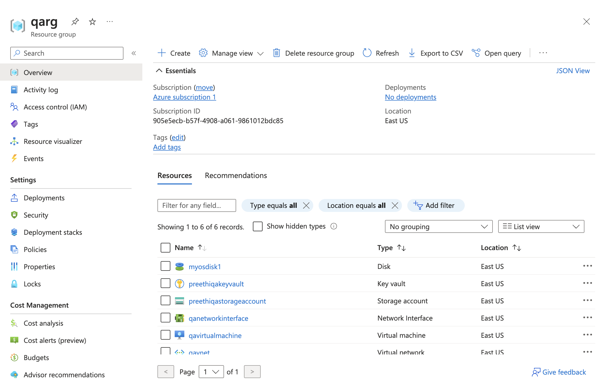
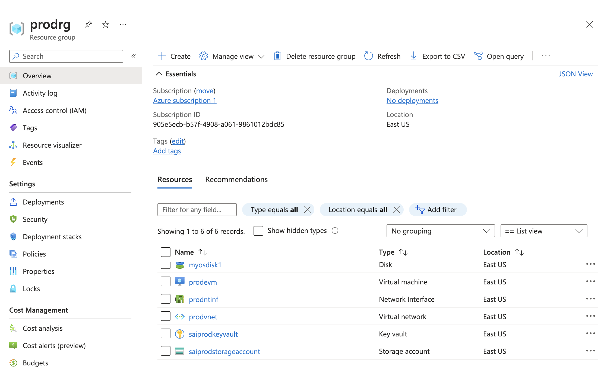

**<h1>CI/CD Pipelines for Infrastructure Provisioning with Terraform</h1>**
**<h3>Objective:</h3>**
The aim of this project is to create Continuous Integration (CI) and Continuous Deployment (CD) pipelines in Azure Pipelines to supply infrastructure across different environments (Dev, QA, Preprod, and Prod) using Terraform. The infrastructure consists of Virtual Machines (VMs), Key Vault, and Storage Accounts.

**<h3>FILES:</h3>**
**<h5>env.tf:</h5>**
Define the Terraform modules for provisioning infrastructure across different environments.
**<h5>main.tf:</h5>** 
Defines the Azure resources (Resource Group, Virtual Network, Subnet, Network Interface, Virtual Machine, Key Vault, Storage Account) using Terraform.
**<h5>variables.tf:</h5>** 
Define variables used in the Terraform configuration for customization of resource names, locations, sizes, etc.
**<h5>azure-pipeline.yml:</h5>** 
Azure Pipelines YAML file for setting up CI/CD pipelines to deploy Infrastructure changes automatically.
**<h3>TERRAFORM CONFIGURATION:</h3>**
The Terraform configuration (env.tf, main.tf, variables.tf) specifies the infrastructure resources that will be provisioned across the various environments. It has modules for building virtual machines, virtual networks, subnets, network interfaces, key vaults, and storage accounts. Customize the variables in variables.tf to meet your specifications.

**<h3>CI/CD PIPELINE:</h3>**
The pipeline.yml file includes the Azure Pipelines YAML settings for creating CI/CD pipelines. It establishes a pipeline trigger on the main branch and stages for delivering infrastructure changes to the Dev, QA, Preprod, and Prod environments via Terraform.

**<h3>Getting Started:</h3>**
To get started with deploying the infrastructure using Terraform and Azure Pipelines:

Make sure you have access to an Azure DevOps organization and have established Azure service principals for authentication.
Update the variables in variables.tf with the values you want for your environment.
Configure the Azure Pipelines YAML file (pipeline.yml) with the appropriate authentication and environment-specific variables.
Commit and push your changes to the repository to trigger the CI/CD workflow.
**<h3>DEPENDENCIES:</h3>**
Azure DevOps organization with the ability to design and manage pipelines.
Azure service principal with the necessary rights for deploying Azure resources.
Terraform was installed on the build agent so that Terraform instructions could be executed.
We welcome your feedback and comments! If you find any problems or have recommendations for improvements, please file an issue or send a pull request.

**<h2>Results:</h2>**

